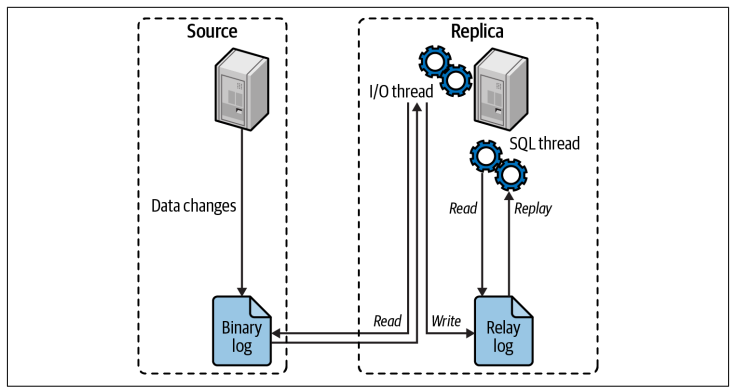

## How MySQL replication works.
1. The source recrods changes to its data in its binary log as "Binary log events"
2. The replica copies the source's binary log event to its own local relay log.
3. The replica replays the event in the relay log, applying the changes to it owns data.
