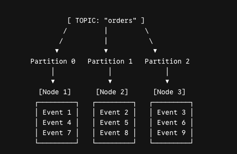

# Kafka Event
### 1. Definition
A kafka Event is a notification that represents somethings that happened in the system at a specific point in time. 

This notification is immutable.

# Producer and Consumer
Producers publish messages to topics and consumers subscribe to those topics to receive the messages.

# Topic
Topic is used to store data that is sent by producers and received by consumers.

# Partitions - Brokers
Kafka uses partitions to improve scalability. 
- Kafka breaks a topic into fractions and store them in many nodes. - These fractions are called by **Partitions**
- Partitions are assigned to different nodes - These nodes are called by **Kafka Brokers**
- Each node above stores many events.


- Kafka guarantees the order of the events within the same topic partition. However. by default, it does not guarantee the order of events across all partitions

- For example: to improve performance, we can divide the topic into two different partitions and read from them on the consumer side. Happy case, a consumer reads the events in the same partition, so these events are in the order. In contrast, If kafka delivers two events to different partitions, we can't guarantee that the consumer reads the events in the order. **Read the event-key below for solution**

# Event Key - Solution for Topic Partitions
The decision regarding which partitions a message enters is determined by hashing message key.

In serveral cases requiring an assurance of order, we should use the same keys for those messages. 

```
Partition Index = |hash(messageKey)| (% Total Partitions)
```

In normal cases, we use the **Entity Id** for message Key (UserId, OrderId,...)

# Kafka Offset
In kafka, Offset is an **Unique Identifier** assigned to each record (message) in a partition. Offsets are sequential integers that Kafka uses to maintain the order of message in a partition. 

They also help producers, consumers, and brokers track the specific position of a message in a partition.